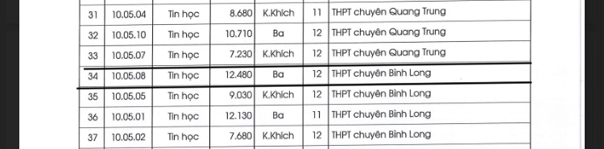
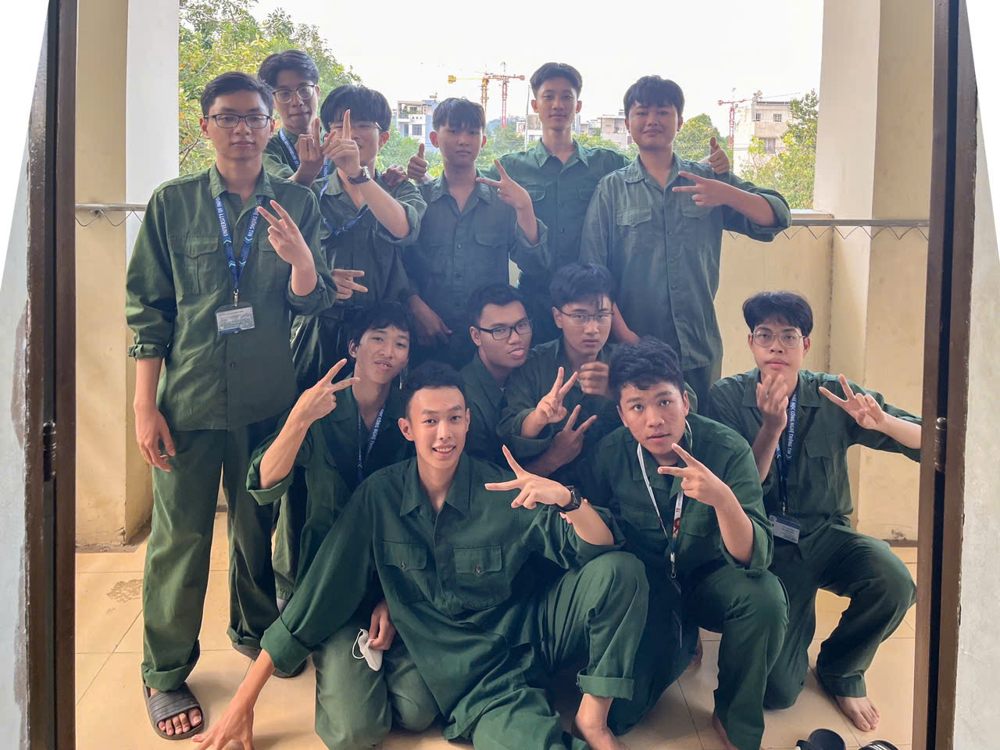
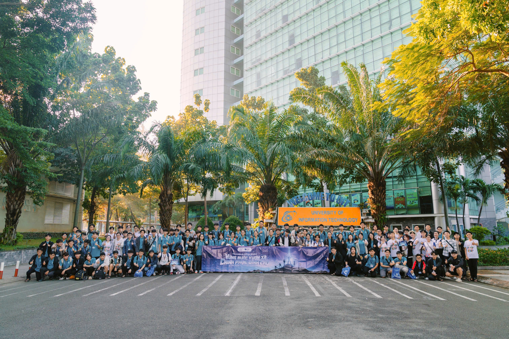
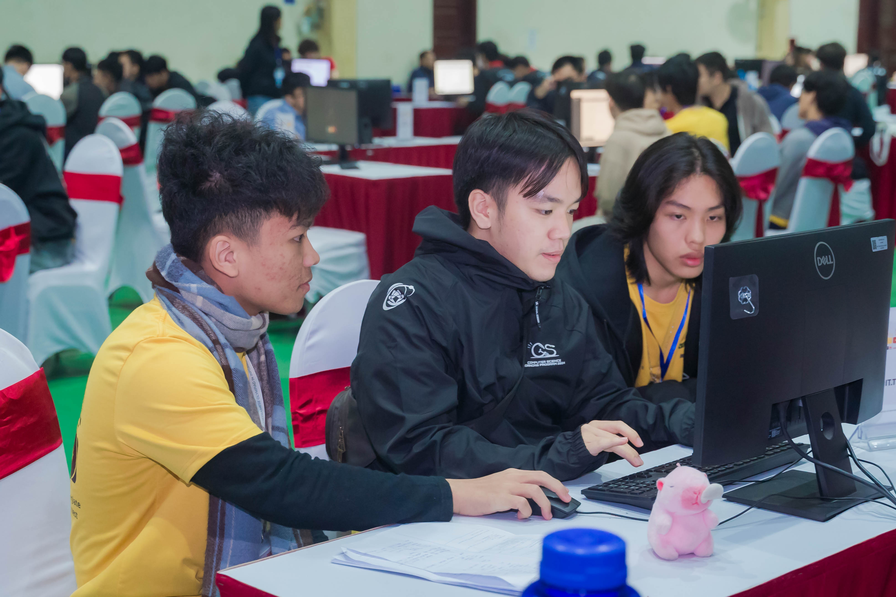
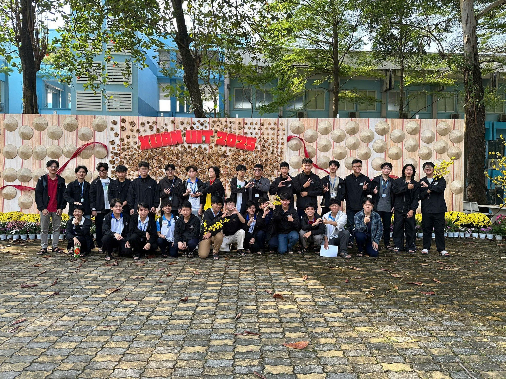

> Khi kim đồng hồ điểm lúc 0 giờ sáng, tiếng pháo hoa vang lên trên khắp bầu trời năm đó.
> Một năm nữa lại qua, có vui, có buồn, có đau khổ có hạnh phúc. Liệu đây là sự kết thúc của một năm tràn đầy sống gió hay ...?

Mở bát năm 2024 là giải ba học sinh giỏi quốc gia. Dù không đạt như kì vọng đề ra trước đó nhưng nó vẫn là một kết quả xứng đáng mỗi khi tôi nhìn lại =))). Tôi đã mất một khoảng thời gian ngắn để vượt qua cú shock của kì thi đó, nó như một cách để tôi nhìn nhận lại bản thân và để tôi biết rằng "Mày vẫn chưa tài đâu, qiocas ạ".

 

Sau khi thi quốc gia xong, tôi đã đi chơi khá nhiều, nào là đi festival với thằng bạn, nào là đi thi mấy kì thi ~~cỏ~~ cùng mấy thằng trong đội tuyển, rồi lại đi Đã Nẵng du lịch cùng với má mì và cuối cùng đi chơi Đà Lạt cùng đám con trai trong lớp.

<video height="400" controls>  <source src="../assets/img/recap-2024/Festival.mp4" type="video/mp4"> </video> <video height="400" controls>  <source src="../assets/img/recap-2024/Dalat.mp4" type="video/mp4"> </video>

Cũng trong khoảng thời gian thi quốc gia xong, tôi đã dành nhiều thời gian với lớp hơn. Tôi đã kết thân với các bạn trong lớp cũng như mấy em khoá dưới dù cho điều đó đáng ra tôi phải làm vào đầu năm học =))). Tôi đã trải qua "Hội trại Xuân" cùng với lớp, tặng bánh kẹo cho các bạn nữ trong lớp vào ngày 8/3, ~~thổ lộ tình cảm với crush~~, viết lưu bút, chụp ảnh kỉ yếu với lớp, và đi du lịch với đám con trai trong lớp. Hầu như tôi chẳng ôn một tí gì để thi tốt nghiệp cả, tôi chỉ tận hưởng những niềm vui khi được học chung với đám bạn mà thôi. Dù cho kết quả đại học có hơi nát bét thật, nhưng chẳng sao cả vì ít nhất tôi biết rằng tôi đã tận hưởng trọn vẹn những tháng năm cuối cùng đó.

<figure align="center">
  
  <figcaption>Ảnh chụp kỷ yếu lớp TT9</figcaption>
</figure>

Tùng tùng tùng, dấu hiệu cho sự kết thúc 3 năm ở chuyên, và cũng như sự bắt đầu của một cuộc sống sinh viên gặp nhiều trắc trở. Lúc này đây, khi tôi đã viết những dòng cuối cùng trong cuốn nhật ký mà tôi viết suốt năm cấp 3, tôi mới thấy mãn nguyện vì những gì mình đã làm vào những phút giây cuối cùng đấy.

Thi tốt nghiệp xong cũng là lúc tôi phải lựa chọn cho ngôi trường đại học mà mình sẽ đồng hành trong 4 năm tới. Tôi có phân vân giữa hai trường, Trường Đại học Công nghệ Thông tin và Trường Đại học Khoa học Tự nhiên. Và cuối cùng, tôi đã quyết định chọn UIT với hi vọng mình sẽ làm được gì đó tại đây.

<video width="300" controls>  <source src="../assets/img/recap-2024/UIT.mp4" type="video/mp4"> </video> <video width="300" controls>  <source src="../assets/img/recap-2024/HCMUS.mp4" type="video/mp4"> </video>

Vào cùng khoảng thời gian đó, tui đã luỵ crush rất nhiều... Đó là một câu chuyện dài mà có lẽ tui sẽ kể nó ở một blog khác.

Khi lên đại học, tui đã mất một khoảng thời gian để bắt nhịp được với cuộc sống mới này, nào là làm quen với những người bạn mới, môi trường mới, nào là học cách vượt qua những áp lực một mình, nào là biết cách quản lý thời gian học và sinh hoạt hiểu quả hơn.

Vào khoảng tháng 10 sau khi vô học được một khoảng thời gian, trường tui tổ chức học quân sự cho sinh viên năm nhất. "Hoài niệm" là hai từ chính xác nhất để miêu tả cảm xúc tui khi học ở đây =))), những kí ức cấp 3 như ùa về vậy. Trường cấp 3 tui có mô hình sinh hoạt giống như học quân sự vậy. Nào là bài báo thức buổi sáng huyền thoại, nào là những buổi dọn dẹp vệ sinh, tới những lúc mấy thầy đi kiểm phòng. Nhìn chung, ở quân sự có lẽ vui hơn chút vì ở đây không quá áp lực việc học như hồi còn học cấp 3 nữa. Tóm lại A2C16 mãi đỉnh :>.

Trước khi lên đại học, tui có mục tiêu sẽ vừa tận hưởng vừa học tập, hơn là chỉ cắm đầu vô học như hồi cấp ba nữa. Và vì thế, tui đã tham gia không ít sự kiện như đêm hội tân sinh viên, tham gia một vài concert, hội trại CS2 của khoa, team building của OEP, đi chơi Maimai cùng mấy thằng bạn, meeting họp mặt ở CLB, thi AIC cùng với anh chị trường khác, cũng như thi ICPC cùng với các bạn trong trường. Ngoài ra, tui cũng tham gia 2 CLB là CLB ICPC và CLB AI.

<figure align="center">
  
  <figcaption>Team building do OEP tổ chức.</figcaption>
</figure>

Đến với kì thi ICPC, đây là kì thi theo đội, mỗi đội cần 3 thành viên. Vì thế nên tui phải kiếm đội trước thì mới thi được. Dù cũng được mời chào bởi các bạn rất khủng khác nhưng cuối cùng tui lập đội cùng với hai người bạn tui quen trước đó ~~và tất nhiên họ cũng khủng vcl~~.

Ở các vòng miền và vòng quốc gia, dù không phải quá xuất sắc nhưng bọn tui có một phong độ ổn định. Để đi tiếp vòng khu vực cần một số điều kiện tham gia như top 3, 5 của trường hoặc top của cả bảng thi ở vòng thi trước đó. Và rất may mắn, team bọn tui đã trót lọt đủ điều kiện tham gia 2 vòng khu vực khi có một khoảng cách rất nhỏ với đội ở nhà (Xin lỗi và cảm ơn các bạn rất nhiều). Và đây cũng là lần đầu tiên tui được đi Hà Nội tại vòng Khu vực Việt Nam, cũng như sẽ là lần đầu tiên được đi nước ngoài tại vòng khu vực Châu Á - Thái Bình Dương sẽ tổ chức ở Singapore vào cuối tháng 2 năm nay. Có thể nói, đây là một thành công và may mắn rất lớn với đội của chúng tui vì bọn tui không nghĩ bọn tui có thể đi xa tới như vậy lun.

<figure align="center">
  
  <figcaption>Ảnh chụp ICPC regional Hanoi được tổ chức tại trường HaUI</figcaption>
</figure>

Đến với CLB AI, tui đã học hỏi và làm quen với những bạn có cùng đam mê với lĩnh vực Trí tuệ nhân tạo. Đây cũng sẽ là một hành trình dài và chắc chắn sẽ xuất hiện vào đợt recap năm sau. Ít nhất hiện tại, tui vẫn đang còn gặp khá nhiều khó khăn khi học ở lĩnh vực này và tui hi vọng có thể vượt qua khó khăn ấy trong tương lai.

Có một ấn tượng khá lớn của tui dành cho lớp Khoa học Tài năng 2024. Tui không hề nghĩ một lớp học ở đại học có thể vui như vậy, mọi người trong lớp đều rất thân thiết và đoàn kết với nhau. Lớp tui đã tổ chức không ít sự kiện trong vỏn vẹn một kì học chung với nhau, như đồng tổ chức tặng quà cho các bạn nữ của hai lớp Tài năng, tổ chức cây thông ước mơ vào dịp Giáng sinh, tổ chức sinh nhật theo tháng cho các bạn trong lớp, tổ chức các buổi học để ôn thi giữa kì, cuối kì và vô vàn những buổi overnight ôn bài chung.

<figure align="center">

  <figcaption>Ảnh chụp lớp Khoa học tài năng 2024</figcaption>
</figure>

Trước khi về nhà ăn Tết, tui cũng có về thăm trường cấp 3 tui học. Ở đây, tui đã gặp lại mấy em trong đội tuyển và ngoài đội tuyển, gặp lại thầy cô cũ đã dạy mình, gặp lại những thầy quản túc đã đem lại những ám ảnh cho tui mỗi tối, gặp lại bác bảo vệ mỗi cuối tháng về nhà, gặp lại cô bán nước mà hồi xưa mỗi sáng tui đều làm một ly bạc xỉu.

<!-- Chốc thoáng đã 6 tháng kể từ lúc tui rời khỏi mái trường ở chuyên. Trường vẫn thế, duy chỉ khác là người con gái tôi thích đã không còn ở đó nữa mà thôi. -->

Kết thúc một năm đầy ý nghĩa, tui đã có những bài học đắt giá cho mình, đã gặp gỡ với nhiều người bạn mới, và vô vàn những thứ khác mà tui đã làm được. Và rồi...

Khi kim đồng hồ điểm lúc 0 giờ sáng, tiếng pháo hoa vang lên trên khắp bầu trời năm đó. Một năm nữa lại qua, có vui, có buồn, có đau khổ có hạnh phúc. Liệu đây là sự kết thúc của một năm tràn đầy sống gió hay một sự khởi đầu mới cho một năm tiếp theo đầy biến động? Tui cũng không biết. Tuy nhiên, có một điều tui biết chắc chắn rằng tui đã một năm thật sự bùng nổ cùng với những người bạn của mình.

Cảm ơn mọi người vì tất cả! Ngoài ra, tui cũng muốn chúc tất cả mọi người đã đọc những dòng cuối cùng này một cái Tết ấm cúng và hạnh phúc bên người thân. Chúc mọi người một năm mới tràn đầy sức khoẻ, và gặp nhiều thành công trên con đường sắp tới nhé!

  <iframe width="250" height="80" src="https://www.youtube.com/embed/TCNpBpY75SQ?autoplay=1&loop=1&playlist=TCNpBpY75SQ" frameborder="0" allow="autoplay" allowfullscreen></iframe>

