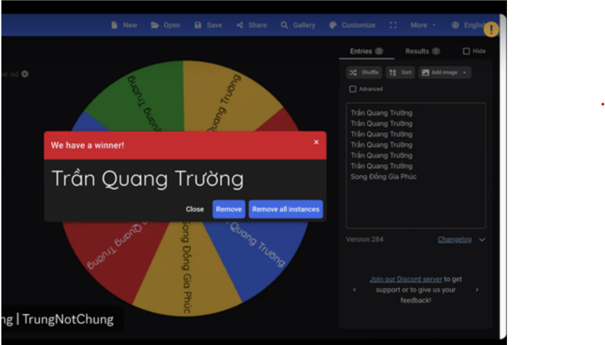
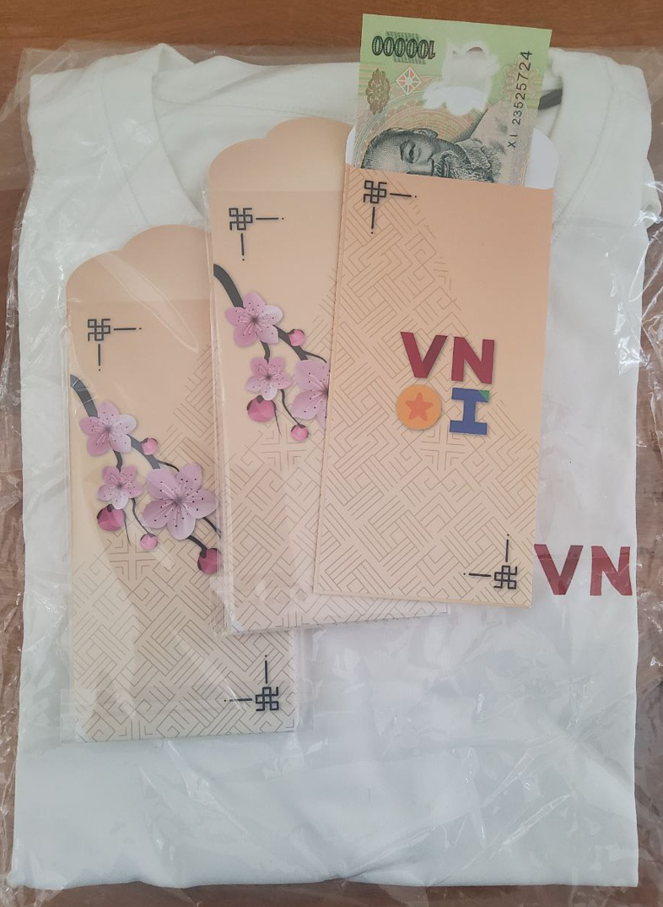

> Trích từ [Tạp chí VNOI 2025](https://drive.google.com/file/d/1pCXt4mniwHsiPEvW65ZkIpfMnaPLeqZn/view).

”Chào mọi người, em là Trần Quang Trường. Hiện tại, em đang là sinh viên năm nhất của trường Đại học Công nghệ Thông tin, ĐHQG-HCM và đã theo chân cùng với VNOI được 2 năm làm tình nguyện viên. Bắt đầu vào lúc em viết đơn ứng tuyển làm TNV VNOI, vào khoảng tháng 8 năm 2023. Em lo lắng khi điền vào đơn ứng tuyển. Vì yêu cầu ứng tuyển, không chỉ cần một background tốt mà cần có niềm đam mê, sự chăm chỉ và thái độ làm việc tốt, bởi thế việc được chọn để nằm trong 30 bạn xuất sắc nhất trong nhiều lá đơn khác nhau là rất đỗi khó khăn.

Với sự cố gắng và sự chờ đợi của mình, em đã không thất vọng khi sau khoảng một tháng, em đã nhận được mail trúng tuyển. Ngày em biết em đậu, em vui như được mùa, vui như cách em đậu vào trường Chuyên cấp 3 vậy!! Bởi việc đậu trong hơn hàng trăm đơn ứng tuyển của những bạn có cùng niềm đam mê khác là thử thách khó khăn. Sau khi vào VNOI, em cùng các bạn TNV khác trong buổi meeting đầu khoá được hướng dẫn các hoạt động chung của nhóm và công việc chuyên môn của team em tham gia. Ví dụ như team contest chuyên về tổ chức tạo các kì thi để học tập cũng như luyện tập, team wiki chịu trách nhiệm việc soạn các bài viết về các thuật toán để đưa tin học nước nhà gần hơn với các bạn học sinh sinh viên, v.v.

Sau buổi meeting, em có khoảng thời gian để làm quen với các công việc chuyên môn. Ở khoảng thời gian đầu này, em gặp đôi chút khó khăn khi chưa nắm rõ được cách sử dụng của Polygon lúc ở team contest hoặc không hiểu được các cú pháp của Markdown khi làm ở team wiki. Nhưng may mắn thay, em được anh chị trong team đã hỗ trợ rất nhiều để giúp em vượt qua giai đoạn làm quen đó. Nhờ quy trình làm việc theo nhóm nhỏ, em đã làm quen được một số bạn TNV khác. Các bạn này rất giỏi ở lĩnh vực lập trình thi đấu nói riêng và ngành công nghệ thông tin nói chung, và nhờ đó mà em đã học hỏi được rất nhiều thứ từ các bạn. Fun fact, teammate ICPC cùng với em sắp tới đi thi ICPC Asia Pacific Championship ở Singapore đều là TNV team contest chung với em.

Cứ mỗi tháng, VNOI tổ chức buổi meeting tổng kết tháng vừa qua. Điều em ấn tưởng nhất ở buổi meeting này chính là bản nhạc quay xổ số huyền thoại khi quay số cho ai may mắn được nhận thưởng cho tháng vừa qua. Càng làm nhiều sẽ tăng tỉ lệ trúng khi tăng số tên xuất hiện trên bảng xổ số, nhưng trúng hay không sẽ tuỳ thuộc vào may mắn của bạn. Và rất ”may mắn” vì hầu như tháng mình đều nhận được thưởng.

<figure align="center">
  
</figure>

Sau khi quay xổ số xong, VNOI thường tổ chức chơi game chung hoặc văn nghệ các kiểu. Và bài văn nghệ em ấn tượng nhất lại buồn cười chính là bài em biểu diễn vào Tết năm ngoái: [QioCas mặc áo VNOI lắc lư trong điệu nhạc Tết](https://www.youtube.com/watch?v=ImGf6zX7e2o). Tuy em múa không đẹp nhưng tiết mục múa của em ngày hôm đó đã để lại những ấn tượng khó quên đối với mọi người vào dịp Tết năm ấy.

Ngoài những buổi meeting cuối tháng, VNOI thường mời những anh lớn có ’máu mặt’ trong ngành để chia sẻ và bàn về những đề tài như hướng nghiệp đi làm, làm sao để có một buổi phỏng vấn thật tốt, cách viết CV, hoặc chia sẻ những kinh nghiệm thi cử như kì thi Quốc gia, ICPC. Qua các buổi như vậy, em đã học hỏi những kiến thức giúp em phát triển trên con đường của bản thân mình.

Vào dịp Tết nguyên đán, VNOI cũng gửi quà chúc mừng tết là những bao lì xì xinh xắn cùng với chiếc áo VNOI. Về chiếc áo, đây như một ghi nhận hành trình của em tại VNOI. Mặc lên mà em cứ ngỡ mặt long bào, ngạo nghễ khi đi khoe với đám bạn cũng như các bà hàng xóm. ’Áo này con được cộng đồng Olympic tin học Việt Nam tặng á các cô chú.’ ! Về bao lì xì cũng có một câu chuyện vui, sau khi lên trường sau Tết em có tổ chức contest để mọi người trong đội tuyển tham gia sau đó tặng những phong bì VNOI với mệnh giá tuỳ thuộc vào số bài đã AC. Oách xà lách vô cùng.

Một kì TNV khoảng 3-4 lần, VNOI tổ chức buổi gặp mặt trực tiếp tại hai đầu Nam Bắc. Thường sẽ là buổi gặp mặt ăn uống, đi chơi đâu đó, hoặc như năm nay em được đi thăm quan các di tích lịch sử. Lúc đầu gặp mặt em có hơi ngại vì hướng nội nhưng nhờ sự nhiệt tình giúp đỡ của anh chị nên em đã đỡ hơn. Qua buổi gặp mặt trực tiếp, em đã làm quen thêm được những người bạn ở team khác mà bình thường em chưa tiếp xúc. Tuy là một buổi ngắn ngủi nhưng đã đọng lại trong em nhiều điều quý giá.

<figure align="center">
  
  <figcaption>Những món quà đặc biệt đến từ VNOI dành cho những bạn tình nguyện viên xuất sắc.</figcaption>
</figure>

Nhiều người thường hay bảo: ”Làm TNV có gì đâu, làm chi cho cực”. Đúng, đã làm một TNV là trên tinh thần tự nguyện không màng lợi ích. Tuy nhiên không vì thế mà bảo làm TNV không được gì, nhờ làm TNV VNOI em đã có cơ hội được làm quen được những người bạn mới, được học hỏi được nhiều kiến thức qua các buổi seminar, và cũng như rèn giũa những kĩ năng cho bản thân (kĩ năng làm việc nhóm, kĩ năng giao tiếp, kĩ năng múa nhảy, . . . ). Vậy còn ”Làm TNV có cực không?” Đó là câu hỏi của bản thân em trước khi điền vào đơn ứng tuyển. Ở hai giai đoạn em viết đơn ứng tuyển là năm lớp 12 chuẩn bị cho kì thi HSGQG và đầu năm nhất chưa bắt nhịp được với cuộc sống sinh viên, thời điểm khó khăn trong việc ôn thi và chật vật với cuộc sống còn đầy điều bỡ ngỡ, em đã khá lo lắng khi sợ việc làm TNV ảnh hưởng tới bản thân. Nhưng nỗi lo ấy đã biến mất sau khi thật sự làm TNV, bởi mỗi tháng em được giao khá ít việc nên nhìn chung việc làm không quá áp lực. Việc được làm bởi sự đam mê dành tin học cũng là một phần khiến em thấy làm TNV vui hơn hết. Ngoài ra, VNOI rất quan tâm tới các TNV do đó em không những không thấy thiệt thòi mà còn được giúp đỡ nhiều trên quá trình phát triển của mình.

Và cứ như vậy, sau gần 10 tháng làm TNV, vào tháng 5 năm 2023, VNOI tổ chức cuối khoá gen 3 và gửi lời cảm ơn tới em cùng những bạn TNV cùng khoá vì đã đồng hành với VNOI trong suốt thời gian qua. Với món quà cuối cùng là những bộ sticker, hình dán, móc khoá và không thể thiếu chính là giấy chứng nhận TNV. Một tờ giấy minh chứng cho quá trình đồng thành với VNOI trong một năm vừa qua. Để mà nói, hành trình đồng hành với VNOI của em là một chặng đường quan trọng trên con đường phát triển bản thân mình. Nhờ VNOI, em học được nhiều thứ, rèn luyện, trau dồi những kĩ năng và tích luỹ cho bản thân những hành trang cần thiết cho sau này.

Một lần nữa, em xin cảm ơn VNOI vì tất cả. Em chúc VNOI tiếp tục phát triển để đưa nền tin học Việt Nam gần hơn với học sinh. Để mỗi nhà 5 mét vuông 1 Tourist, để Việt Nam đạt được những thành tích cao hơn trong những cuộc thi quốc tế. Một cái Tết nữa lại đến, em xin chúc mọi người trong VNOI cũng như tất cả bạn đang học tin học trên cả nước một cái Tết ấm no, tràn đầy niềm vui, gặp nhiều may mắn và thành công trên con đường sự nghiệp ạ.”