Chào mọi người, mình là QioCas. Khác với năm ngoái, năm nay mình sẽ không đăng facebook lì xì như năm ngoái nữa. Lý do là bởi năm nay là một năm đặc biệt. Còn đặc biệt như nào thì mời mọi người đọc blog nhé </3.

Như đã kể ở năm trước, mở đầu năm nay là đợt tham gia thi ICPC vòng khu vực Châu Á - Thái Bình Dương tổ chức tại Singapore và đây là lần đầu tiên mình được đi nước ngoài. Lần đầu được gặp người nước ngoài, lần đầu được ăn những món ăn lạ ở đó, và là lần đầu được đi dạo thành phố cả buổi đêm. Trải nghiệm ở Sing thật sự đã đem lại cho mình nhiều thứ mới mẻ, và những sự kiện đáng nhớ cùng với mọi người.

  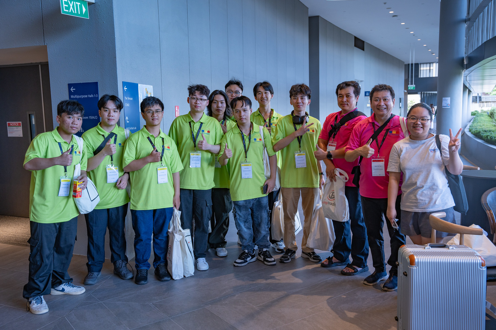
  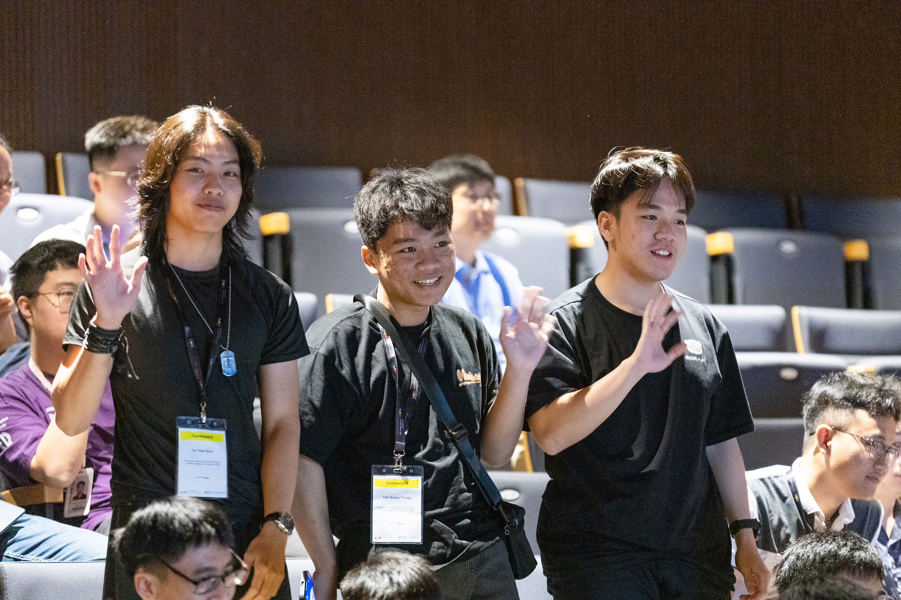
  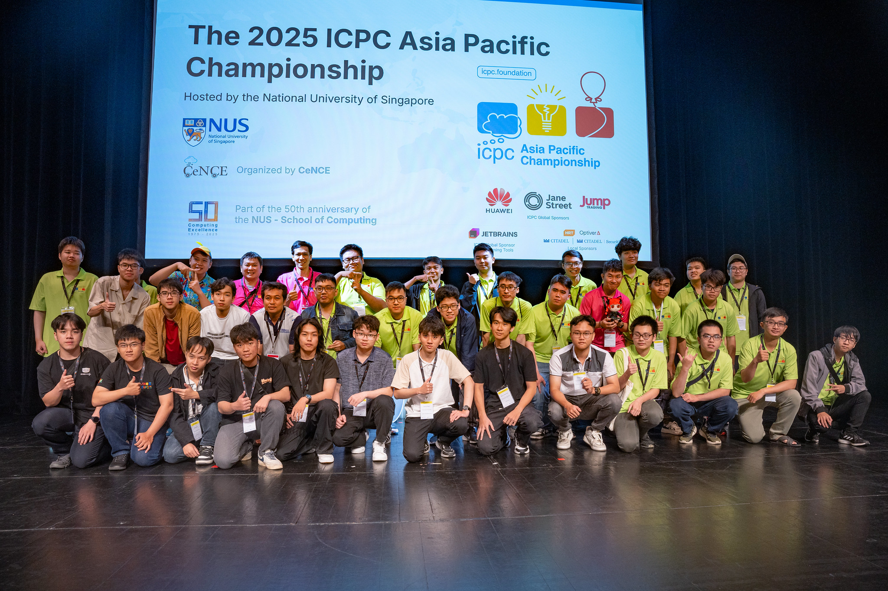
  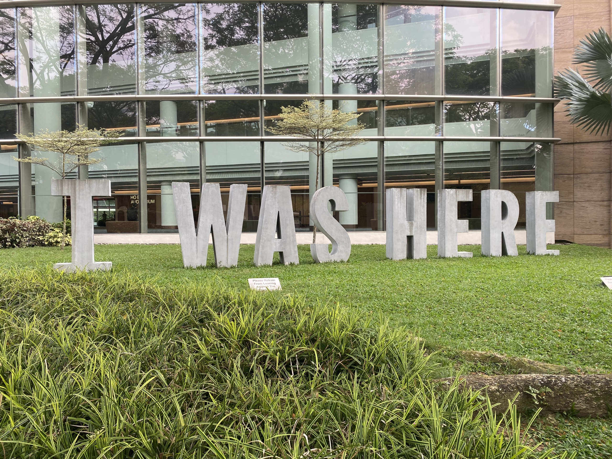
  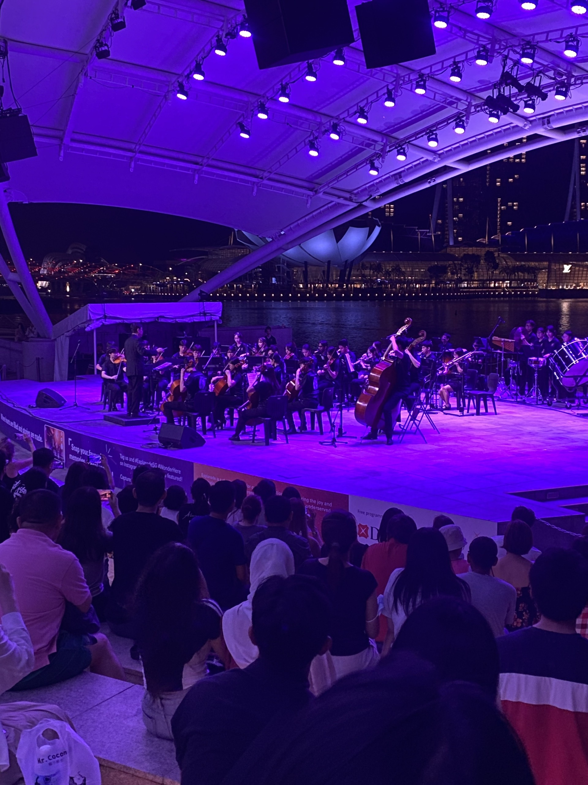
  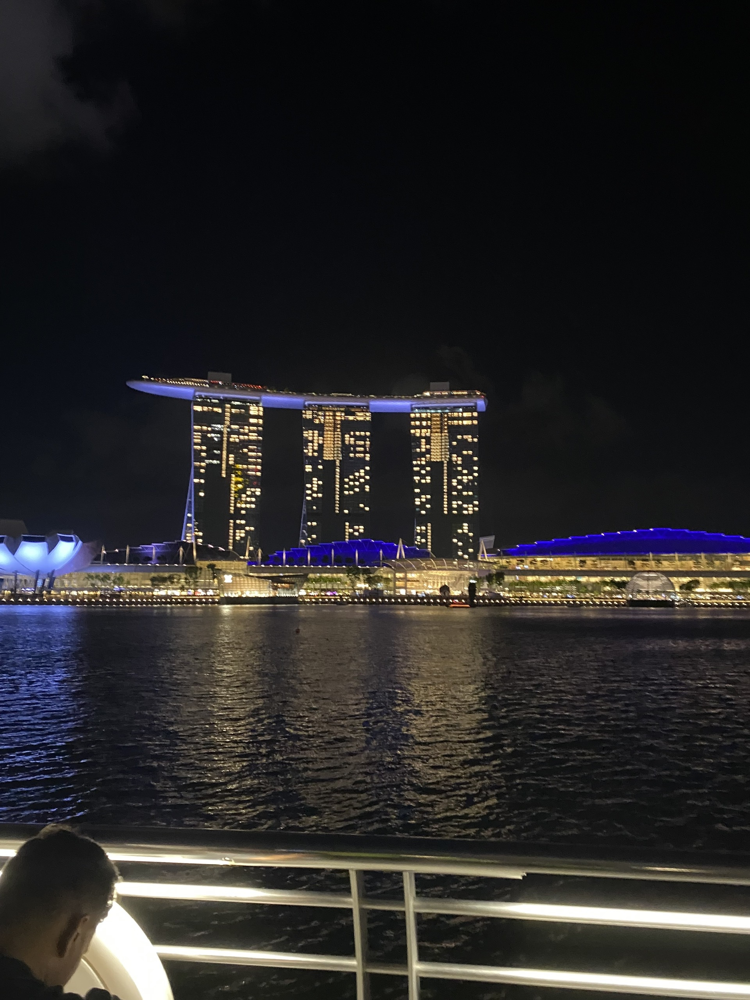
  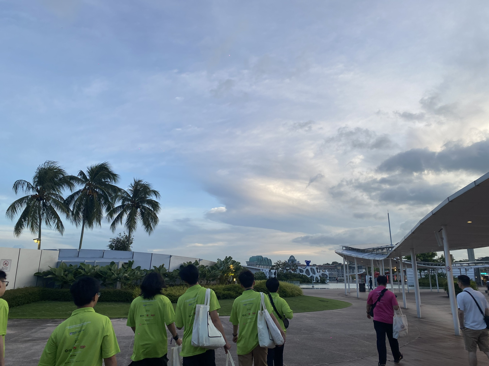

Bên cạnh ICPC, năm 2025 mình cũng đã tham gia không ít các cuộc thi học thuật khác như Đấu trường IT, Bách Khoa Code Challenge, ... . Dù không phải đạt kết quả quá cao, nhưng với mình, điều vui nhất không phải kết quả mà là quá trình tham gia cùng với bạn bè và đồng đội.

  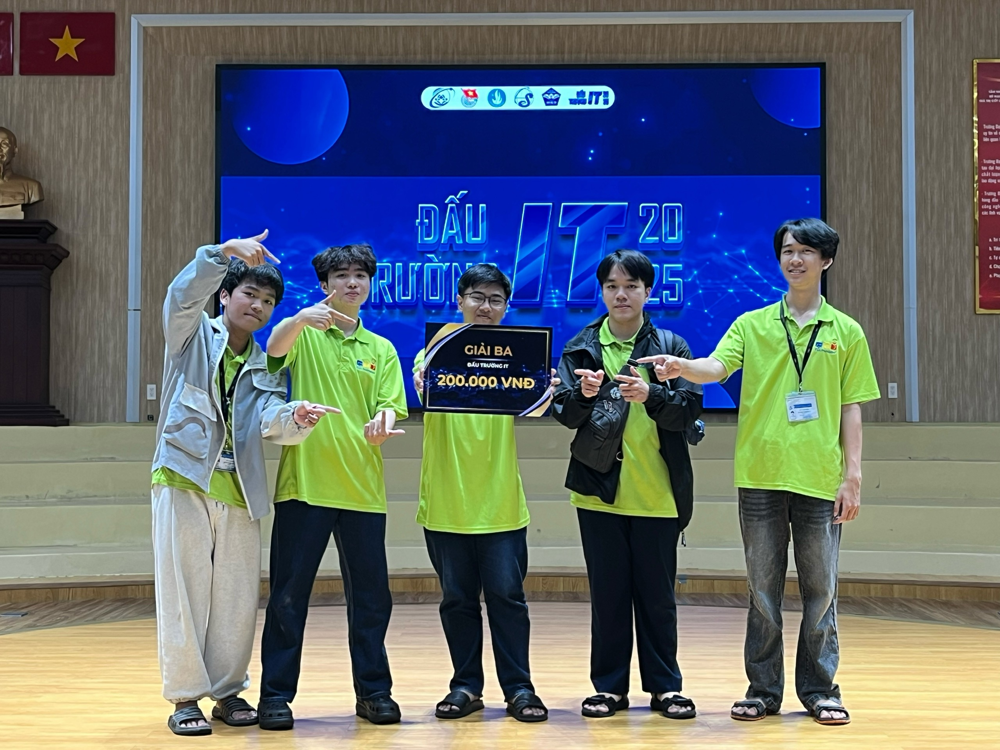
  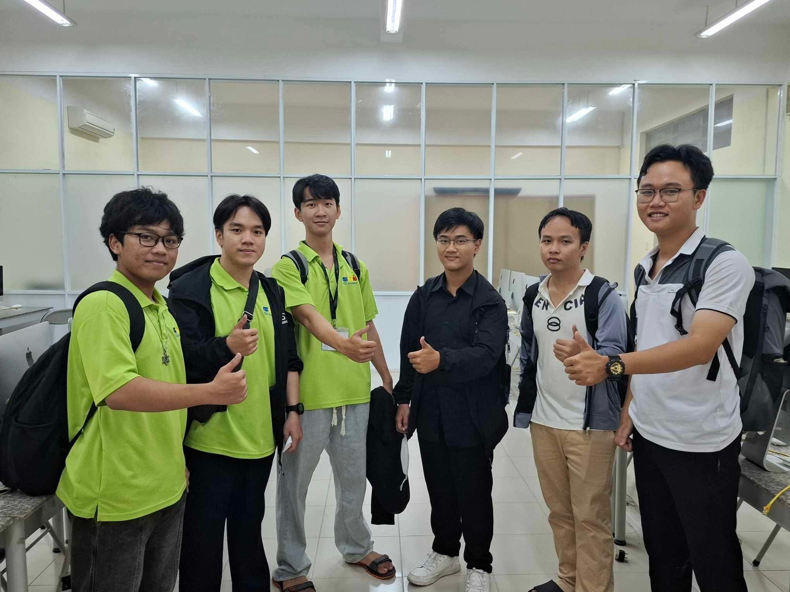

Nói đến CLB AI thì đáng buồn là mình ~~bị kick~~ out sau năm nhất. Trong thời gian mình còn thường xuyên lên CLB, mình quả thật đã học hỏi được nhiều thứ qua các buổi seminar mà clb tổ chức và mình cũng đăng ký một số cuộc thi AI để thử sức bản thân. Tuy nhiên, vì bản thân mình quá lười biếng nên thành ra cả học kỳ 2 năm nhất, chẳng có kỳ thi nào mình đăng ký mà mình thật sự tham gia cả. Điều đó khiến mình tự trách rất nhiều và cũng tự hẹn với lòng rằng: "Trong phần còn lại của 2025, mình sẽ không đăng ký tham gia cuộc thi AI nào nữa.

Dẫu vậy, không phải vì thế mà mình ghét AI. Trong một năm vừa qua, mình đã học nhiều về AI, dù với bản thân mình nó chỉ ở mức cơ bản. Và thật ra, đã có một số câu chuyện xảy ra xoay quanh tới câu chuyện mình học AI như nào, cũng như những dự định tương lai của bản thân, tuy nhiên mình sẽ dành nó cho một blog riêng trong tương lai khi thật sự nó đã có một cái happy end.

Bên cạnh đó, mình cũng đã học thêm một số kiến thức cơ bản của triết học và tâm lý học. Một mặt lý do là do mình thấy nó thú vị; Mặt khác, mình nghĩ nó là cần thiết cho một số vấn đề mình gặp phải.

Năm nay cũng là tròn 50 năm Ngày Giải phóng miền Nam, thống nhất đất nước (30/4/1975 - 30/4/2025), và 80 năm ngày Quốc Khánh (2/9/1945 - 2/9/2025). Lễ Quốc Khánh tổ chức ở Hà Nội đương nhiên mình không thể đi được nhưng lễ 30/4 thì có. Chiều 29/4, sau khi đi coi phim với bạn, bọn mình đã đi camp từ tối đó. Tuy nhiên, do camp trễ nên cũng chả có chỗ ngắm tốt lắm. Dẫu vậy điều đó cũng không quan trọng, vì với mình cái vui là cái không khí đông vui, nhộn nhịp của mọi người trong ngày lễ trọng đại.

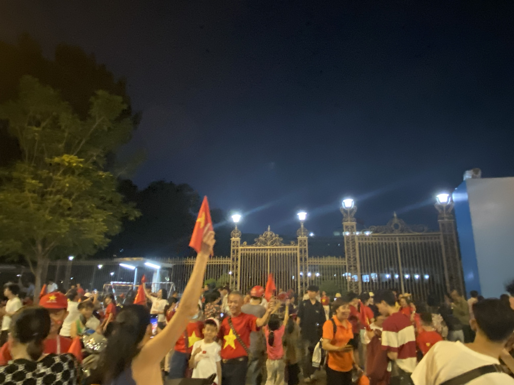 

Cũng liên quan đến ngày 30/4, là một thành viên của chi hội lớp, mình được lớp cử tham gia tập nhảy đồng diễn ca khúc “Đất nước trọn niềm vui”. Tập đâu đó 3 ngày ở USSH còn tập dượt và biểu diễn ở nhà Văn hóa sinh viên. Đây là một hoạt động tốn sức với cá nhân mình, tuy vậy nó cũng đem lại những trải nghiệm đáng nhớ.

  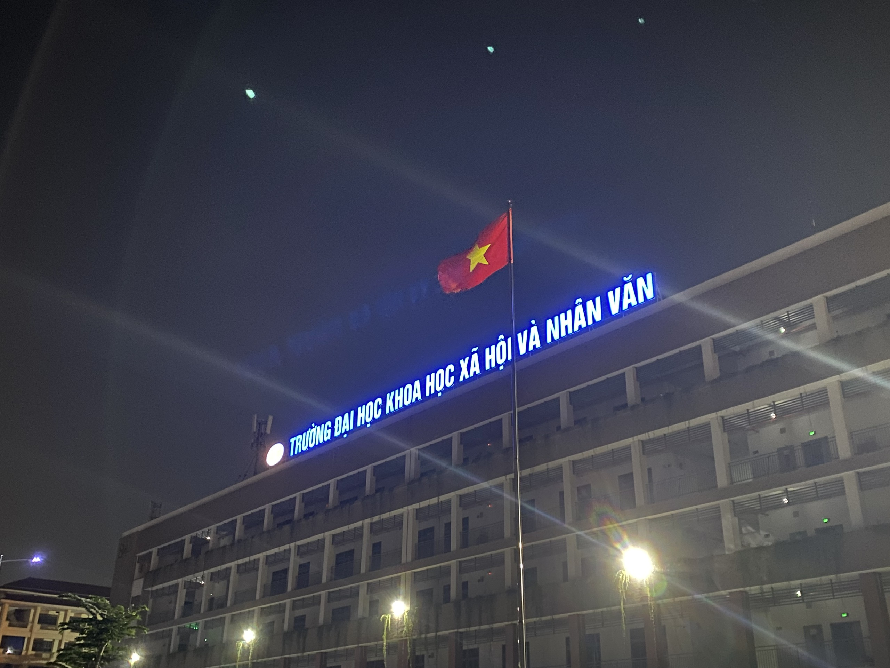
  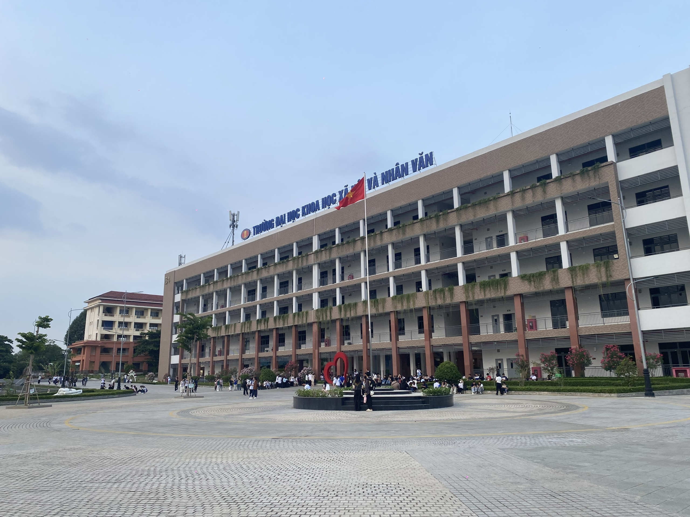
  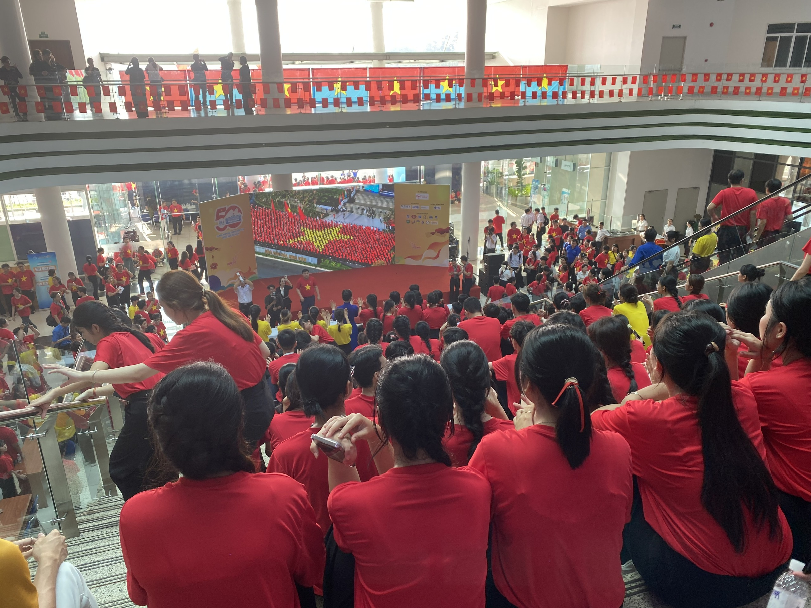

Hè 2025, mình đáng tiếc bỏ lỡ một đợt đi chơi Đà Lạt do vấn đề sức khỏe. Ngoài đó ra, đáng nhớ nhất chắng là tham dự đám cưới của chị gái mình. Chỉ đơn giản là một bửa tiệc đám cưới, nó đặc biệt bởi vì đó là đám cưới của chị gái mình.

 

Cũng trong hè, hầu hết thời gian mình chỉ ở nhà ngồi nằm và ngồi chill chill bên laptop. Có chăng là có một tuần lúc mình chưa về nhà mà vẫn còn ở Sài gòn; Trong một tuần, nào là đi lên thăm trường cấp 3 của thằng bạn, thăm thằng đệ khóa dưới, đi ăn uống linh tinh, nào là đi coi phim Conan, Vô Hạn Thành, Mưa đỏ cùng với bạn. Mình vẫn còn nhớ một ngày trước khi mình xem Vô Hạn Thành, mình còn chưa xem tập nào của Kny. Thành ra mình phải speedrun cày anime trước khi đi xem phim.

  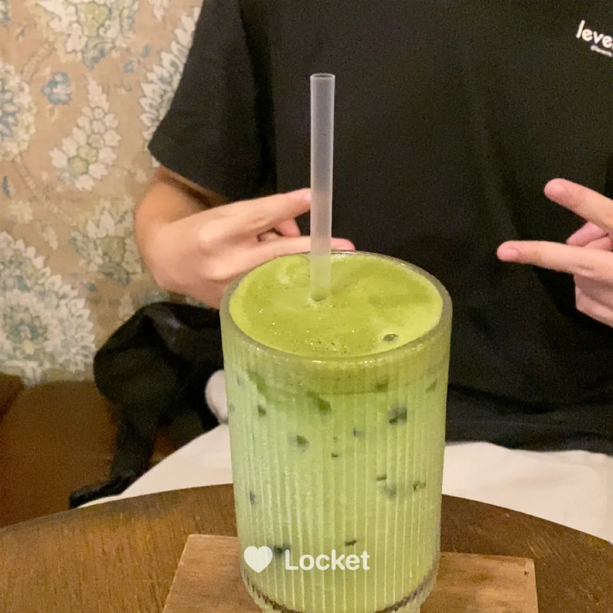
  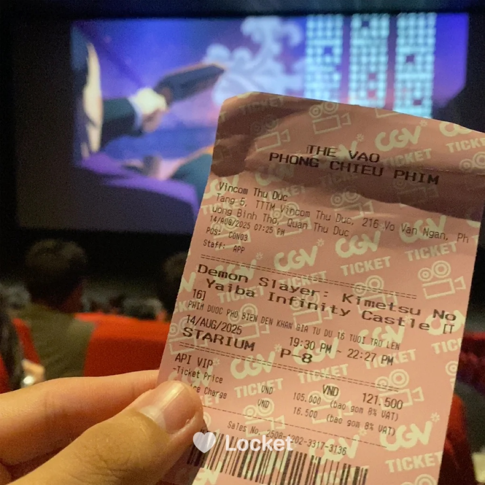
  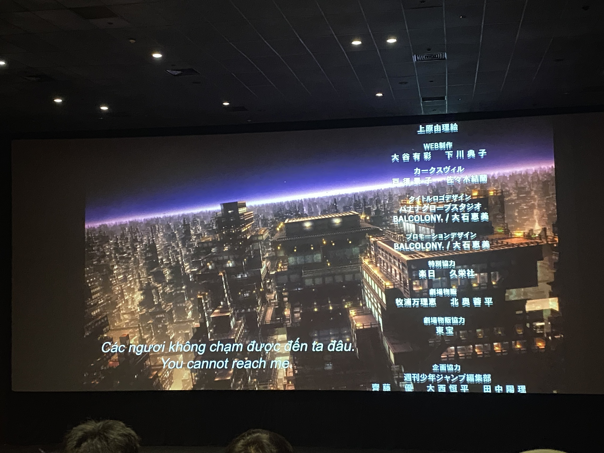
  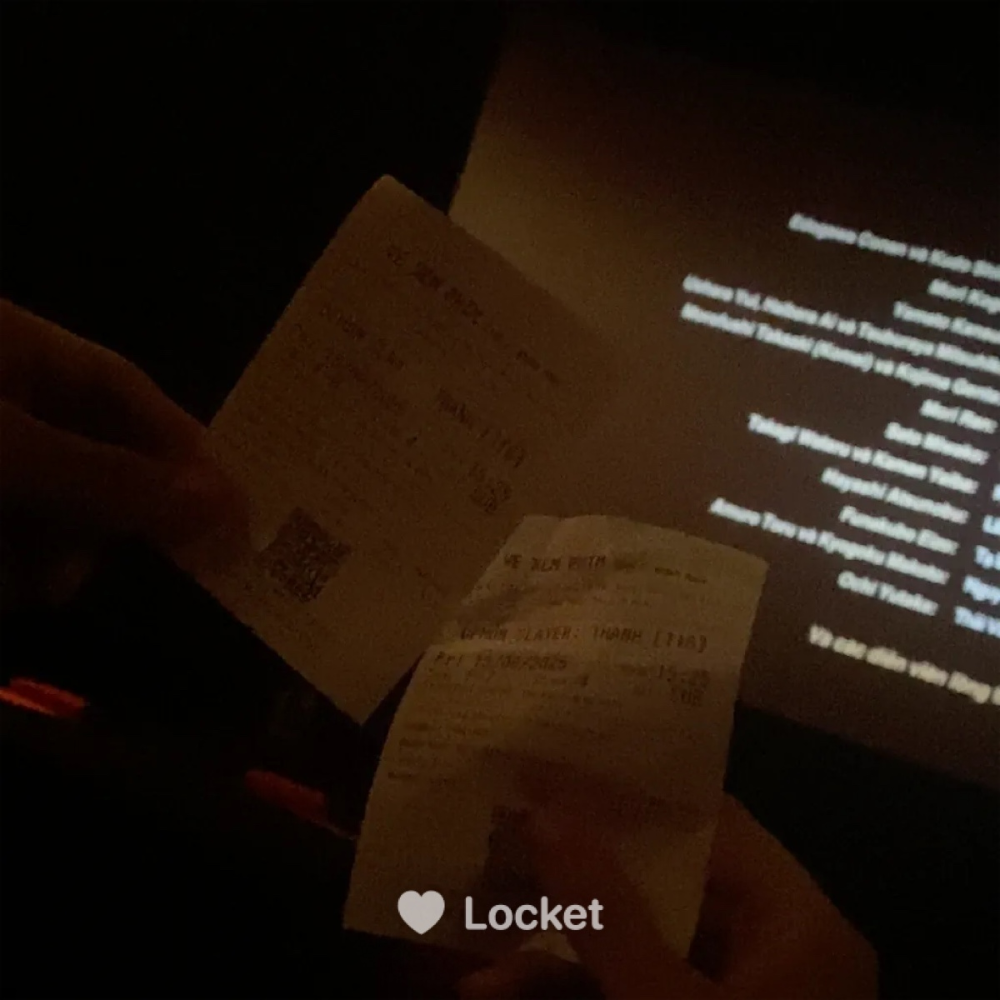
  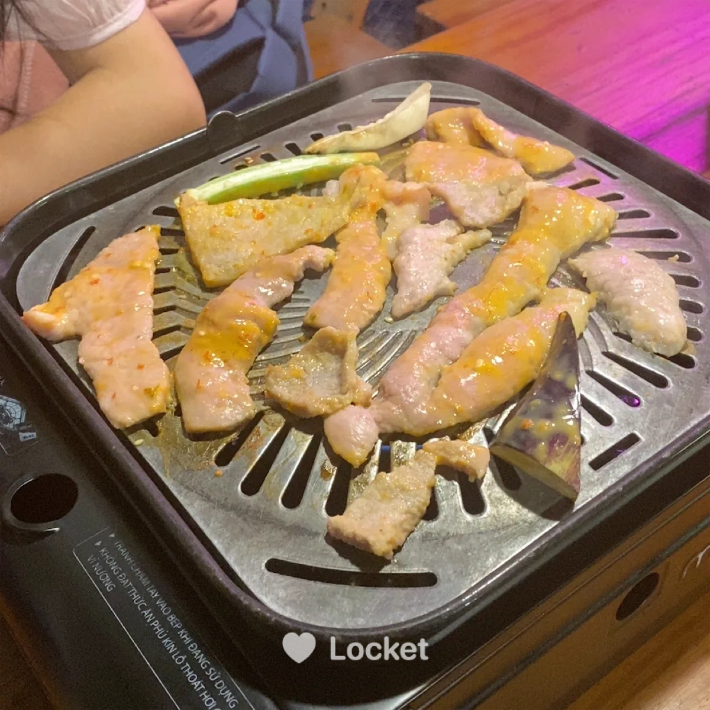

Vào khoảng tháng 10, mình thi bằng lái xe máy. Mình ôn và tập lái vào một ngày trước khi thi. Trong nói là thế chứ mình cũng có chút lo lắng vì mình không đi buổi lái thử xe và mình thi bằng A tức lái xe côn nên cũng khiến mình khá lo lắng. Hôm đi thi mình còn mặc quần đùi đi thi xém nữa bị cấm thi luôn may sao vẫn xoay sở được. Kết quả may sao vẫn đậu, thầy đăng ký cho mình còn bất ngờ vì mình còn chẳng đi buổi lái xe thử và mình cũng chẳng có nhiều kinh nghiệm lái xe côn lắm.

Mình cũng đã dự định học IELTS vào học kỳ một năm hai luôn. Song, vì sự lười biếng của mình mà mình vẫn trì trệ đến hiện tại vẫn chưa ôn thi. Mình dự tính sẽ ôn thi cùng với bạn mình tới hè, nhưng kết quả như nào thì tương lai mới biết được. Mình đã tự dự định quá nhiều và cũng đã delay quá nhiều rồi.

Học kỳ 1 năm 2 mình vẫn tiếp tục thi ICPC, tuy nhiên năm nay không may mắn, bọn mình đã rớt từ vòng Quốc Gia. Nếu bảo không buồn thì sẽ là nói dối tuy nhiên buồn cũng chỉ là một giai đoạn vừa thi xong. Chứ mình vẫn bằng lòng dù kết quả có ra sao đi nữa, vì đơn giản mình đã có một năm nhất thật sự quá peak, chẳng có gì ở ICPC để mình phải hối tiếc hơn nữa.

Có lẻ mình cũng không cần nhắc lại nếu mọi người đã đọc blog recap 2024 của mình, đó là mình thật sự rất hài lòng với lớp của mình hiện tại - Khoa học Tài năng 2024. Mình cũng có làm một video đợt tổ chức đại hội chi đoàn lớp nhân dịp tổng kết, tóm tắt cả các hoạt động của lớp từ đầu năm đến hiện tại:

  

    <iframe
      src="https://www.youtube.com/embed/2gdu8WTeZmg"
      title="YouTube video player"
      frameborder="0"
      allow="accelerometer; autoplay; clipboard-write; encrypted-media; gyroscope; picture-in-picture; web-share"
      allowfullscreen>
    </iframe>
  

Học kỳ một năm hai, mình cũng làm quen được một số cu em khóa dưới. Mình cũng hay đi ăn uống với mấy đứa. Và cũng có dịp, mình cũng lên thành phố để đi chơi cùng mọi người như đi Cafe Maid ~~dù fail~~, đi dạo đường sách, đi dạo phố đi bộ, ngắm nhà thờ đức bà vào dịp noel, và tham gia dev fest 2025.

  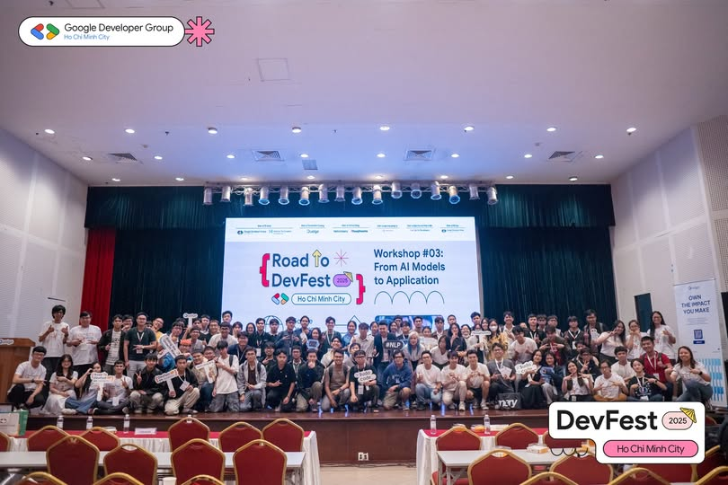
  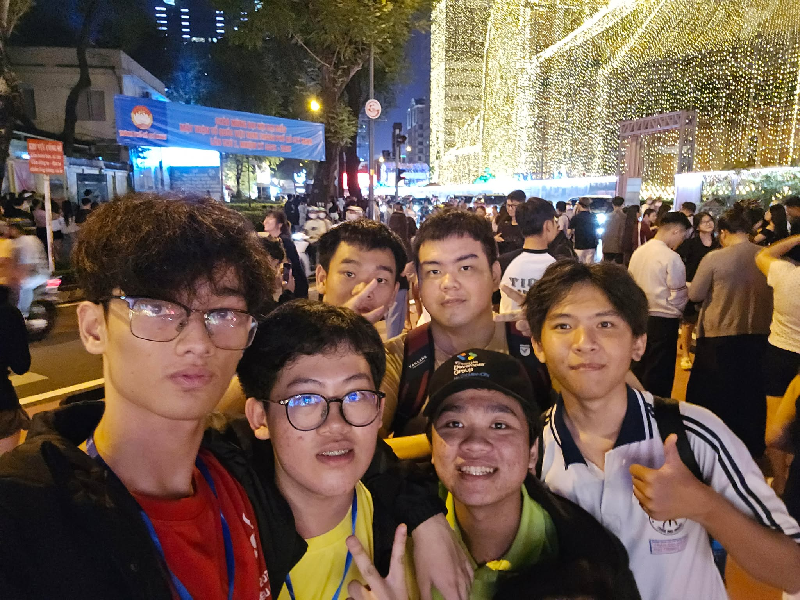
  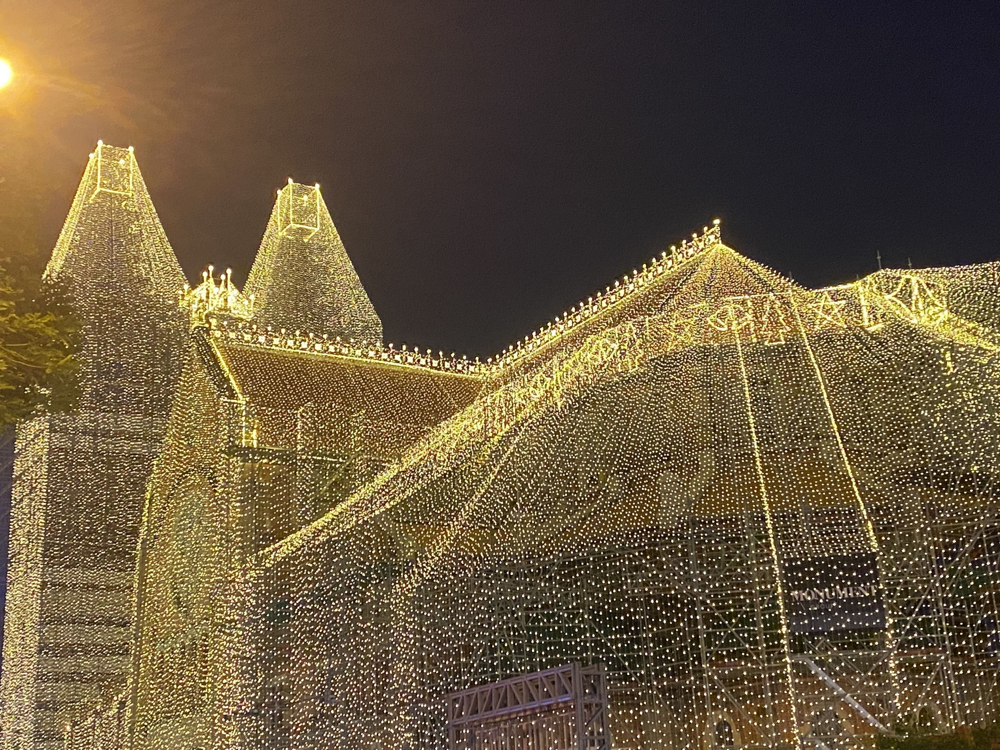

Và ...

> Có những ngày nắng, có những ngày mưa.

Bên cạnh những niềm điều tích cực, năm vừa qua, mình đã có những quyết định sai lầm, những hành động vô tình dẫn đến ảnh hưởng tới bản thân và những người xung quanh. "Có những sai lầm phải trả giá" và mình luôn tự trách và hối hận với những hành động mình đã làm. Một mặt tích cực nào đó, mình sẽ dần trưởng thành hơn qua những sai lầm như vậy. Nhưng ở mặt tiêu cực, mình tự hoài nghi bản thân mình và nhiều thứ liên quan. 

Có lẻ bởi vậy, năm nay là năm đặc biệt với mình. Nó đặc biệt không phải vì mình đạt được thành tựu gì đánh nhớ hay gặp phải sang chấn nào khiến mình tuyệt vọng. Chỉ đơn giản là một nốt thăng trầm, có lên, có xuống, có vui, có buồn. Nếu năm ngoái là sự hoài niệm quá khứ và một chút tò mò cho một hành trình mới, thì năm nay đó là quá trình mình đang phát triển qua những lần vượt qua thử thách. Những bài học năm nay với mình đã đem phần nhiều trọng lượng hơn và năm tới chắc lẻ cũng thế hoặc hơn. Vì thế, mình vẫn sẽ cố gắng hơn để đối diện với những thử thách và trưởng thành hơn từng ngày.

Để kết thúc recap năm nay, mình muốn dành lời cảm ơn tới tất cả mọi người vì đã đồng thành với mình trong một năm vừa qua. Cảm ơn các bạn đã ở bên cạnh mình trong những lúc mình vui nhất cũng như những lúc mình gặp khó khăn nhất. Cảm ơn những câu chuyện mà các bạn kể cho mình, những câu chuyện ấy phần nhiều giúp mình đáng kể. Cũng cảm ơn các bạn vì đã lắng nghe những câu chuyện mà mình chia sẻ, dù nhiều lúc mình cũng chẳng biết mình nói cái gì. Một lần nữa, cảm ơn mọi người rất nhiều. Chúc mọi người có một năm mới tràn đầy niềm vui bên người thân và gia đình. Chúc mừng năm mới </3.

